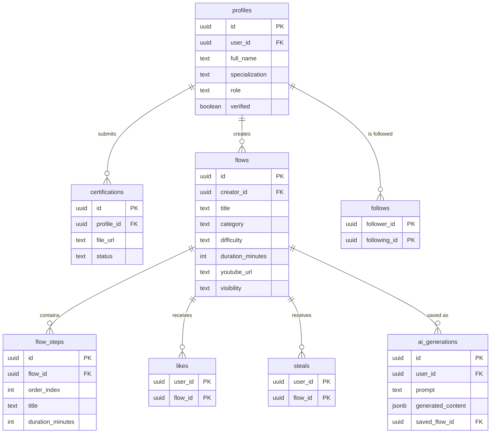

# Steal My Flow 🧘‍♀️🔥

**A living library of class flows for fitness & wellness instructors.**
Discover, save ("steal"), reuse and AI-generate complete, structured lesson plans — in English and Hebrew (full RTL).

> Final project — AI-Based Product Development course.

- **Live app:** https://spoyt-app.vercel.app/
- **Repo:** https://github.com/Omeralyagon/spoyt-app
- **Demo logins** (after running the seed): `maya@stealmyflow.app` / `demo1234` (instructor), `admin@stealmyflow.app` / `demo1234` (admin)

---

## 1. Overview

Steal My Flow is a social platform built specifically for yoga, Pilates, barre,
functional-training and wellness instructors to **create, share, discover, save
and reuse structured class flows** — and to **generate new flows with AI**. Think
of it as a focused hybrid of Pinterest, Instagram and Notion, but only for
professional, teachable lesson plans.

## 2. The problem

Instructors spend hours planning classes, and their inspiration is scattered
across Instagram, YouTube, WhatsApp groups, Google Drive and personal notes.
There is **no dedicated home** for discovering complete class structures, saving
them, organizing them, and reusing them later. So they rebuild lesson plans from
scratch, again and again.

## 3. Target audience

Yoga / Vinyasa / Power Yoga teachers, Pilates & Reformer instructors, barre and
functional-training coaches, and wellness professionals — people who **create
new classes constantly** and need fresh, high-quality, professional ideas.

## 4. Competitors & differentiation

| Today's "solution" | Why it falls short | How Steal My Flow is different |
|---|---|---|
| **Instagram / YouTube** | Built for consumption & reach, not structured, reusable plans | Every flow is a structured, step-by-step lesson plan you can save and adapt |
| **Pinterest** | Generic image bookmarking, no domain structure | Domain-native: category, difficulty, duration, ordered steps, verified authors |
| **Google Docs / Notion / Excel** | Private, unstructured, not a community | A community library with discovery, following and a one-tap **Steal** to your own library |
| **ChatGPT alone** | Generic, ephemeral, not stored or shared, no community trust | AI is built **into** the product — generations are saved, editable and shareable, alongside human, **certification-verified** instructors |

**Unique value proposition:** the signature **"Steal"** action — save any class
straight into your personal library to adapt and reuse — combined with an
**AI Flow Studio** and **certification-verified** instructors, in one bilingual,
mobile-first product.

## 5. Core features

- 🔎 **Discover feed** with a relevance score (likes + steals + recency) and category filters
- 🫳 **Steal** — save a flow to your library; ❤️ **Like**; 🔗 **Share**
- 🧩 **Flow detail** — cover, ordered steps with timing, embedded YouTube, creator + follow
- ✍️ **Create flow** — title, category, difficulty, duration, steps, images, video, validation
- ✨ **AI Flow Studio** — describe a class (type / duration / level / goal) → structured warmup→main→cooldown flow → save to library; full **generation history**
- 📚 **Personal library** — Created / Saved / AI-generated tabs
- 👤 **Instructor profiles** — bio, specialization, verified badge, followers, flows
- 🛡️ **Certifications & Admin** — upload credentials → admin approves/rejects → verified badge
- 🌐 **Bilingual EN/HE** with instant language switch and full RTL/LTR
- 💎 Premium "Kinetic Stillness" design system, skeletons, empty/error states, toasts

## 6. Architecture

```
Next.js 15 (App Router, RSC + Server Actions)
        │
        ├── next-intl  ──────────►  EN / HE, RTL/LTR, middleware locale routing
        │
        ├── Server Actions / Route Handlers (secrets stay server-side)
        │         │
        │         ├── Supabase  ──►  Postgres + Row Level Security
        │         │                  Auth (email + Google OAuth)
        │         │                  Storage (avatars / covers / certifications)
        │         │
        │         └── AI layer  ──►  Claude (default) · OpenAI (swappable)
        │
        └── Vercel (hosting)
```

- **Frontend:** Next.js 15, TypeScript, Tailwind CSS, shadcn/ui, lucide-react
- **Backend:** Supabase (Postgres, Auth, Storage, RLS), Next.js Server Actions
- **AI:** `@anthropic-ai/sdk` with structured JSON output; provider-swappable to OpenAI
- **Security:** RLS on every table; AI keys & service role used **only** server-side; `is_admin()` policy guard; per-user certification storage paths

## 7. Database & ERD

8 normalized tables + a `flow_stats` view, all protected by Row Level Security.
SQL lives in [`supabase/migrations/0001_init.sql`](supabase/migrations/0001_init.sql).



## 8. External services & integrations

| Service | Type | What it's used for |
|---|---|---|
| **Supabase Auth** | Authentication | Email/password + **Google OAuth** sign-in; session cookies refreshed in middleware |
| **Supabase Postgres** | Database | All app data (8 tables) with Row Level Security |
| **Supabase Storage** | File storage | Avatars, flow covers, and certification files (private bucket) |
| **Supabase RLS** | Authorization | Per-row access control; `is_admin()` guard for moderation |
| **Anthropic Claude API** | AI (server-side) | Generates structured class flows (warmup→main→cooldown) as validated JSON |
| **OpenAI API** | AI (optional) | Drop-in alternative provider (`AI_PROVIDER=openai`) |
| **YouTube** | Embed | Optional class video embedded on flow detail |
| **Vercel** | Hosting / CI | Production deployment of the Next.js app |

## 9. Getting started

```bash
# 1. Install
npm install

# 2. Configure env
cp .env.example .env.local   # fill in Supabase + AI keys

# 3. Create the schema
#    Run supabase/migrations/0001_init.sql in the Supabase SQL editor
#    (enable the Google provider under Auth → Providers, redirect to /auth/callback)

# 4. (optional) Seed demo data
node supabase/seed.mjs        # needs SUPABASE_SERVICE_ROLE_KEY

# 5. Run
npm run dev                   # http://localhost:3000
```

### Deploy to Vercel
Import the repo, set the same env vars (`NEXT_PUBLIC_SUPABASE_URL`,
`NEXT_PUBLIC_SUPABASE_ANON_KEY`, `SUPABASE_SERVICE_ROLE_KEY`, `ANTHROPIC_API_KEY`,
`NEXT_PUBLIC_SITE_URL`), and deploy. Add the Vercel URL to Supabase Auth's
redirect allow-list (`<url>/auth/callback`).

## 10. Project structure

```
src/
  app/[locale]/        feed · flow/[id] · create · generate · library · profile/[id] · admin · login
  app/auth/callback/   OAuth / email confirmation handler
  components/          UI primitives (shadcn) + feature components
  i18n/                next-intl routing & navigation
  lib/                 supabase clients, queries, server actions, AI layer
  middleware.ts        i18n routing + Supabase session refresh
messages/              en.json · he.json
supabase/              migrations · seed.mjs · erd.mmd
design/                Kinetic Stillness design philosophy + canvas
```

## 11. Design & AI process

The visual language is documented as a design philosophy,
[`design/KINETIC_STILLNESS.md`](design/KINETIC_STILLNESS.md), expressed as a
museum-grade plate ([`design/kinetic-stillness.png`](design/kinetic-stillness.png)).
See [`docs/AI_DEVELOPMENT_PROCESS.md`](docs/AI_DEVELOPMENT_PROCESS.md) for how AI
tools were used throughout the build (the "Vibe Coding" log).

## 12. Environment variables

| Variable | Where | Purpose |
|---|---|---|
| `NEXT_PUBLIC_SUPABASE_URL` | client+server | Supabase project URL |
| `NEXT_PUBLIC_SUPABASE_ANON_KEY` | client+server | Supabase anon key |
| `SUPABASE_SERVICE_ROLE_KEY` | server only | seeding / admin tasks |
| `AI_PROVIDER` | server only | `gemini` (free) · `anthropic` · `openai` |
| `GEMINI_API_KEY` | server only | Google Gemini (free tier) |
| `ANTHROPIC_API_KEY` | server only | Claude (paid) |
| `OPENAI_API_KEY` | server only | OpenAI (paid) |
| `NEXT_PUBLIC_SITE_URL` | client | canonical site URL |

## 13. Troubleshooting

- **AI generation fails / "temporarily unavailable":** set `AI_PROVIDER=gemini`
  and `GEMINI_API_KEY` (free key from aistudio.google.com/apikey) in Vercel →
  **Redeploy**. Paid providers (`anthropic`/`openai`) require account credits.
- **Uploads or flow publishing fail:** run
  [`supabase/migrations/0003_idempotent_setup.sql`](supabase/migrations/0003_idempotent_setup.sql)
  once in the Supabase SQL editor — it (re)creates the storage buckets and all
  RLS policies. Safe to run repeatedly.
- **Profile shows blank / 404:** fixed automatically — the profile row is
  created on first authenticated request.
- **Login screen shows app navigation:** fixed — nav is hidden on public routes.
- **Changes not visible on the live site:** confirm Vercel's Production Branch is
  `main` and redeploy after changing environment variables.

See [`CHANGELOG.md`](CHANGELOG.md) and
[`docs/IMPLEMENTATION_REPORT.md`](docs/IMPLEMENTATION_REPORT.md) for the full
production-hardening report.
